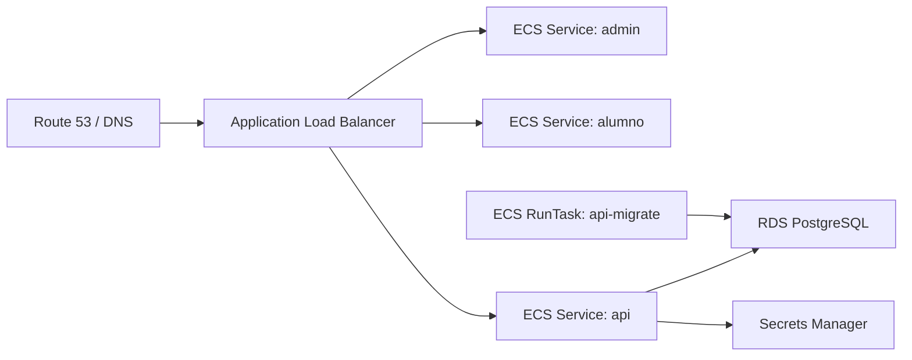

# AWS

## Servicios recomendados

- Amazon ECS Fargate para API, admin y alumno.
- Amazon RDS for PostgreSQL para la base de datos.
- AWS Secrets Manager para credenciales y JWT secrets.
- Application Load Balancer para routing por host y ruta.
- AWS Certificate Manager para TLS.
- Amazon CloudWatch Logs para logs.
- Amazon ECR o GHCR para imagenes.
- Route 53 para DNS, si el dominio esta en AWS.

## Arquitectura



## Reglas del load balancer

- Host `admin.example.com` -> servicio `admin`, puerto 3000.
- Host `alumno.example.com` -> servicio `student`, puerto 3000.
- Host `api.example.com` o path `/api/*` -> servicio `api`, puerto 3000.

## Variables y secretos

Guardar en Secrets Manager:

- `DATABASE_URL`
- `JWT_ACCESS_SECRET`
- `JWT_REFRESH_SECRET`

Configurar como variables no secretas:

- `NODE_ENV=production`
- `PORT=3000`
- `API_PREFIX=api/v1`
- `CORS_ORIGINS=https://admin.example.com,https://alumno.example.com,https://api.example.com`
- `TRUST_PROXY=true`
- `SWAGGER_ENABLED=false`

## Migraciones

Antes de actualizar el servicio API, ejecutar una tarea one-off en ECS:

```bash
pnpm db:migrate
```

La tarea debe usar la imagen `exam-platform-api-migrate` y los mismos secretos de la API.

## Despliegue

1. Crear VPC privada, subnets publicas para ALB y subnets privadas para ECS/RDS.
2. Crear RDS PostgreSQL con backups automaticos y cifrado.
3. Crear ECS cluster.
4. Crear task definitions para `api`, `admin`, `student` y `api-migrate`.
5. Crear ALB con certificado ACM y reglas por host.
6. Ejecutar tarea `api-migrate`.
7. Actualizar servicios ECS con las nuevas imagenes.

## Rollback

- Mantener al menos dos task definitions anteriores.
- Si una version falla health checks, volver a la revision anterior del servicio ECS.
- No revertir migraciones automaticamente; preparar scripts de correccion o migraciones reversibles cuando el cambio sea riesgoso.
