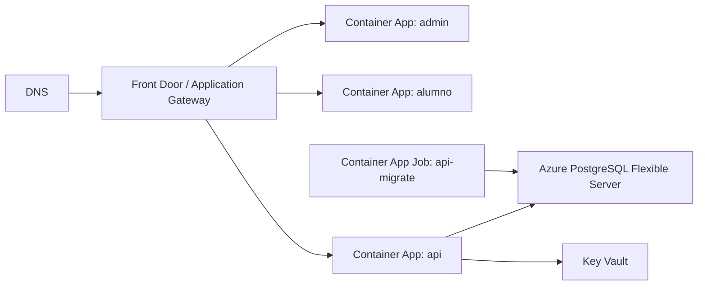

# Azure

## Servicios recomendados

- Azure Container Apps para API, admin y alumno.
- Azure Container Apps Jobs para migraciones.
- Azure Database for PostgreSQL Flexible Server.
- Azure Key Vault para secretos.
- Azure Container Registry o GHCR para imagenes.
- Azure Front Door o Application Gateway para routing y TLS.
- Log Analytics para observabilidad.

## Arquitectura



## Reglas de entrada

- `admin.example.com` -> Container App `admin`.
- `alumno.example.com` -> Container App `student`.
- `api.example.com` o `/api/*` -> Container App `api`.

## Variables y secretos

Guardar en Key Vault:

- `DATABASE_URL`
- `JWT_ACCESS_SECRET`
- `JWT_REFRESH_SECRET`

Variables de API:

- `NODE_ENV=production`
- `PORT=3000`
- `API_PREFIX=api/v1`
- `CORS_ORIGINS=https://admin.example.com,https://alumno.example.com,https://api.example.com`
- `TRUST_PROXY=true`
- `SWAGGER_ENABLED=false`

## Migraciones

Crear un Container Apps Job con la imagen `exam-platform-api-migrate` y comando:

```bash
pnpm db:migrate
```

Ejecutarlo antes de promover la nueva revision de la API.

## Despliegue

1. Crear Resource Group y Log Analytics Workspace.
2. Crear Azure Database for PostgreSQL Flexible Server con backups.
3. Crear Container Apps Environment.
4. Crear Container Apps `api`, `admin` y `student`.
5. Crear Container Apps Job `api-migrate`.
6. Configurar secretos desde Key Vault.
7. Configurar Front Door o Application Gateway con certificados TLS.
8. Ejecutar `api-migrate`.
9. Publicar nuevas revisiones de contenedores.

## Rollback

- Azure Container Apps permite volver trafico a una revision anterior.
- Mantener una revision estable con peso de trafico 0 antes de eliminarla.
- Validar health checks antes de asignar 100% del trafico.
