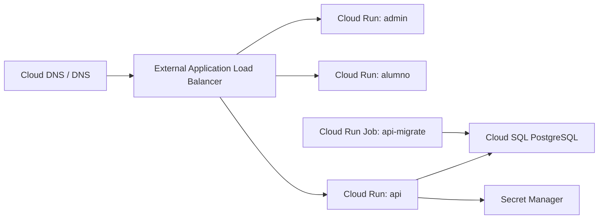

# Google Cloud

## Servicios recomendados

- Cloud Run para API, admin y alumno.
- Cloud Run Jobs para migraciones.
- Cloud SQL for PostgreSQL.
- Secret Manager para secretos.
- Artifact Registry o GHCR para imagenes.
- External Application Load Balancer para dominios y TLS.
- Cloud Logging y Cloud Monitoring.

## Arquitectura



## Routing

- `admin.example.com` -> Cloud Run service `admin`.
- `alumno.example.com` -> Cloud Run service `student`.
- `api.example.com` o `/api/*` -> Cloud Run service `api`.

## Variables y secretos

Guardar en Secret Manager:

- `DATABASE_URL`
- `JWT_ACCESS_SECRET`
- `JWT_REFRESH_SECRET`

Variables de API:

- `NODE_ENV=production`
- `PORT=3000`
- `API_PREFIX=api/v1`
- `CORS_ORIGINS=https://admin.example.com,https://alumno.example.com,https://api.example.com`
- `TRUST_PROXY=true`
- `SWAGGER_ENABLED=false`

## Base de datos

Usar Cloud SQL con IP privada cuando el servicio este dentro de una VPC controlada. Si se usa conector Cloud SQL, validar el formato de `DATABASE_URL` en un entorno staging antes de produccion.

## Migraciones

Crear un Cloud Run Job con la imagen `exam-platform-api-migrate` y comando:

```bash
pnpm db:migrate
```

Ejecutarlo antes de desplegar la nueva revision de API.

## Despliegue

1. Crear proyecto, red y Cloud SQL PostgreSQL.
2. Crear secretos en Secret Manager.
3. Publicar imagenes en Artifact Registry o GHCR.
4. Crear Cloud Run services para `api`, `admin` y `student`.
5. Crear Cloud Run Job `api-migrate`.
6. Configurar dominios, certificados y load balancer.
7. Ejecutar `api-migrate`.
8. Actualizar revisiones de Cloud Run.

## Rollback

- Mantener revisiones previas de Cloud Run.
- Si falla una revision, enviar trafico a la revision anterior.
- No revertir migraciones de forma automatica sin plan de datos.
