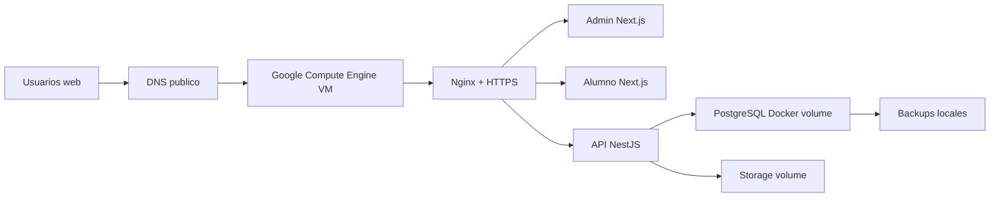
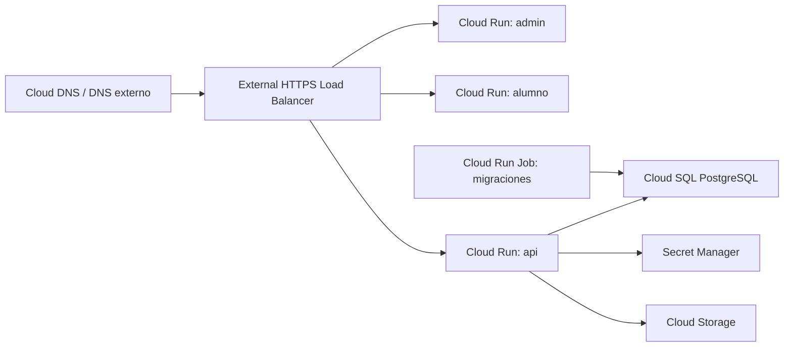

# Google Cloud

## Ruta recomendada para primera publicacion

Para este proyecto, la ruta recomendada inicial en Google Cloud es:

```text
Compute Engine VM + Docker Compose + Nginx + Let's Encrypt + PostgreSQL en volumen persistente
```

Motivo: el repositorio ya esta preparado con `docker-compose.yml`, Nginx, Certbot, PostgreSQL persistente, backups y scripts de operacion. Esta ruta permite publicar el sistema completo sin redisenar la arquitectura.

Manual paso a paso:

```text
docs/despliegue-google-cloud.md
```

## Tamano sugerido

Para pruebas o demo:

```text
VM: e2-small
Disco: 30 GB o 50 GB
Sistema: Ubuntu 24.04 LTS
```

Para primera produccion:

```text
VM: e2-medium
Disco: 50 GB o 100 GB
Sistema: Ubuntu 24.04 LTS
```

## Arquitectura inicial



## Evolucion recomendada

Cuando el sistema tenga usuarios reales constantes, mayor criticidad o mayor presupuesto, separar servicios administrados:

- Cloud SQL for PostgreSQL para base de datos administrada.
- Cloud Storage para backups y archivos.
- Secret Manager para secretos productivos.
- Cloud Logging y Cloud Monitoring para observabilidad administrada.
- Cloud Run para separar API, admin y alumno en servicios administrados.

## Arquitectura futura administrada



## Fuentes oficiales

- Compute Engine: https://cloud.google.com/products/compute
- Crear VM Linux: https://docs.cloud.google.com/compute/docs/create-linux-vm-instance
- Conectar por SSH: https://docs.cloud.google.com/compute/docs/connect/standard-ssh
- Reglas de firewall: https://docs.cloud.google.com/compute/docs/samples/compute-firewall-create
- Cloud SQL backups: https://docs.cloud.google.com/sql/docs/postgres/backup-recovery/backups
