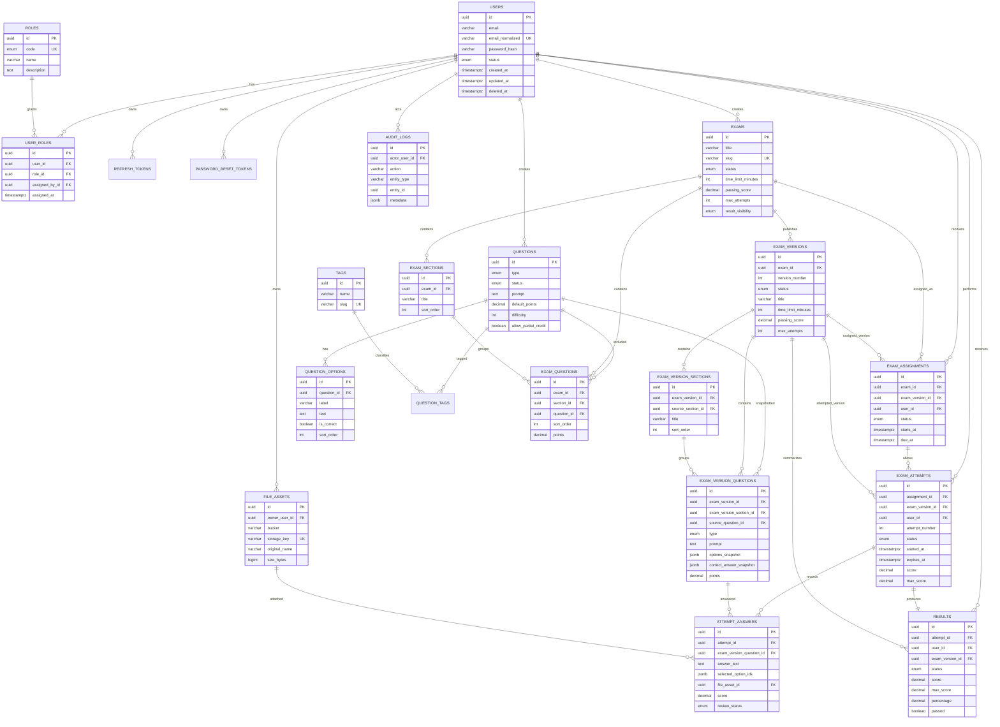

# Diagrama ER

```mermaid
erDiagram
  USERS ||--o{ USER_ROLES : has
  ROLES ||--o{ USER_ROLES : grants
  USERS ||--o{ REFRESH_TOKENS : owns
  USERS ||--o{ PASSWORD_RESET_TOKENS : owns
  USERS ||--o{ QUESTIONS : creates
  USERS ||--o{ EXAMS : creates
  USERS ||--o{ EXAM_ASSIGNMENTS : receives
  USERS ||--o{ EXAM_ATTEMPTS : performs
  USERS ||--o{ RESULTS : receives
  USERS ||--o{ FILE_ASSETS : owns
  USERS ||--o{ AUDIT_LOGS : acts

  QUESTIONS ||--o{ QUESTION_OPTIONS : has
  QUESTIONS ||--o{ QUESTION_TAGS : tagged
  TAGS ||--o{ QUESTION_TAGS : classifies
  QUESTIONS ||--o{ EXAM_QUESTIONS : included
  QUESTIONS ||--o{ EXAM_VERSION_QUESTIONS : snapshotted

  EXAMS ||--o{ EXAM_SECTIONS : contains
  EXAMS ||--o{ EXAM_QUESTIONS : contains
  EXAM_SECTIONS ||--o{ EXAM_QUESTIONS : groups
  EXAMS ||--o{ EXAM_VERSIONS : publishes

  EXAM_VERSIONS ||--o{ EXAM_VERSION_SECTIONS : contains
  EXAM_VERSIONS ||--o{ EXAM_VERSION_QUESTIONS : contains
  EXAM_VERSION_SECTIONS ||--o{ EXAM_VERSION_QUESTIONS : groups

  EXAMS ||--o{ EXAM_ASSIGNMENTS : assigned_as
  EXAM_VERSIONS ||--o{ EXAM_ASSIGNMENTS : assigned_version
  EXAM_ASSIGNMENTS ||--o{ EXAM_ATTEMPTS : allows
  EXAM_VERSIONS ||--o{ EXAM_ATTEMPTS : attempted_version
  EXAM_ATTEMPTS ||--o{ ATTEMPT_ANSWERS : records
  EXAM_VERSION_QUESTIONS ||--o{ ATTEMPT_ANSWERS : answered
  FILE_ASSETS ||--o{ ATTEMPT_ANSWERS : attached
  EXAM_ATTEMPTS ||--|| RESULTS : produces
  EXAM_VERSIONS ||--o{ RESULTS : summarizes

  USERS {
    uuid id PK
    varchar email
    varchar email_normalized UK
    varchar password_hash
    enum status
    timestamptz created_at
    timestamptz updated_at
    timestamptz deleted_at
  }

  ROLES {
    uuid id PK
    enum code UK
    varchar name
    text description
  }

  USER_ROLES {
    uuid id PK
    uuid user_id FK
    uuid role_id FK
    uuid assigned_by_id FK
    timestamptz assigned_at
  }

  QUESTIONS {
    uuid id PK
    enum type
    enum status
    text prompt
    decimal default_points
    int difficulty
    boolean allow_partial_credit
  }

  QUESTION_OPTIONS {
    uuid id PK
    uuid question_id FK
    varchar label
    text text
    boolean is_correct
    int sort_order
  }

  TAGS {
    uuid id PK
    varchar name
    varchar slug UK
  }

  EXAMS {
    uuid id PK
    varchar title
    varchar slug UK
    enum status
    int time_limit_minutes
    decimal passing_score
    int max_attempts
    enum result_visibility
  }

  EXAM_SECTIONS {
    uuid id PK
    uuid exam_id FK
    varchar title
    int sort_order
  }

  EXAM_QUESTIONS {
    uuid id PK
    uuid exam_id FK
    uuid section_id FK
    uuid question_id FK
    int sort_order
    decimal points
  }

  EXAM_VERSIONS {
    uuid id PK
    uuid exam_id FK
    int version_number
    enum status
    varchar title
    int time_limit_minutes
    decimal passing_score
    int max_attempts
  }

  EXAM_VERSION_SECTIONS {
    uuid id PK
    uuid exam_version_id FK
    uuid source_section_id FK
    varchar title
    int sort_order
  }

  EXAM_VERSION_QUESTIONS {
    uuid id PK
    uuid exam_version_id FK
    uuid exam_version_section_id FK
    uuid source_question_id FK
    enum type
    text prompt
    jsonb options_snapshot
    jsonb correct_answer_snapshot
    decimal points
  }

  EXAM_ASSIGNMENTS {
    uuid id PK
    uuid exam_id FK
    uuid exam_version_id FK
    uuid user_id FK
    enum status
    timestamptz starts_at
    timestamptz due_at
  }

  EXAM_ATTEMPTS {
    uuid id PK
    uuid assignment_id FK
    uuid exam_version_id FK
    uuid user_id FK
    int attempt_number
    enum status
    timestamptz started_at
    timestamptz expires_at
    decimal score
    decimal max_score
  }

  ATTEMPT_ANSWERS {
    uuid id PK
    uuid attempt_id FK
    uuid exam_version_question_id FK
    text answer_text
    jsonb selected_option_ids
    uuid file_asset_id FK
    decimal score
    enum review_status
  }

  RESULTS {
    uuid id PK
    uuid attempt_id FK
    uuid user_id FK
    uuid exam_version_id FK
    enum status
    decimal score
    decimal max_score
    decimal percentage
    boolean passed
  }

  FILE_ASSETS {
    uuid id PK
    uuid owner_user_id FK
    varchar bucket
    varchar storage_key UK
    varchar original_name
    bigint size_bytes
  }

  AUDIT_LOGS {
    uuid id PK
    uuid actor_user_id FK
    varchar action
    varchar entity_type
    uuid entity_id
    jsonb metadata
  }
```
