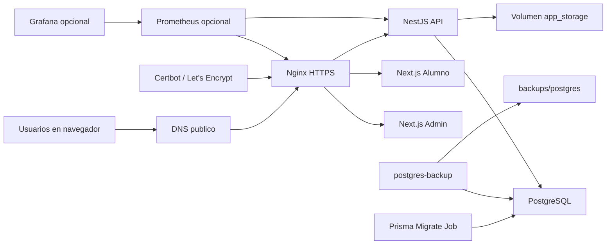

# Manual tecnico

## Arquitectura productiva web



## Componentes

- API: NestJS con JWT, RBAC, Prisma y PostgreSQL.
- Admin: Next.js en modo produccion con `next start`.
- Alumno: Next.js en modo produccion con `next start`.
- DB: PostgreSQL 16 en volumen persistente `postgres_data`.
- Storage: volumen persistente `app_storage`, montado en `/app/storage`.
- Proxy: Nginx con hosts separados y HTTPS.
- Certificados: Certbot con validacion webroot.
- Backups: servicio `postgres-backup` y scripts manuales.
- Monitoreo opcional: Prometheus, Grafana, Node Exporter, cAdvisor y Blackbox Exporter.

## Variables criticas

| Variable | Uso |
| --- | --- |
| `POSTGRES_PASSWORD` | Contrasena de PostgreSQL. |
| `JWT_ACCESS_SECRET` | Firma de access tokens. |
| `JWT_REFRESH_SECRET` | Firma de refresh tokens. |
| `ADMIN_HOST` | Dominio publico del panel administrador. |
| `STUDENT_HOST` | Dominio publico del modulo alumno. |
| `API_HOST` | Dominio publico de la API. |
| `CERT_NAME` | Nombre del certificado Let's Encrypt, normalmente igual a `ADMIN_HOST`. |
| `CORS_ORIGINS` | Origenes HTTPS permitidos por la API. |
| `SWAGGER_ENABLED` | Debe ser `false` en produccion publica. |
| `NEXT_PUBLIC_API_BASE_URL` | Ruta publica de API usada por los frontends. |
| `BACKUP_RETENTION_DAYS` | Dias de retencion de backups locales. |
| `BACKUP_INTERVAL_SECONDS` | Frecuencia de backup automatico. |

Si la contrasena de base de datos contiene caracteres especiales, debe ser segura para URL porque Compose construye `DATABASE_URL`.

## Despliegue Docker Compose

1. Crear `.env.production` desde `.env.production.example`.
2. Configurar dominios reales y secretos.
3. Verificar DNS hacia el servidor.
4. Ejecutar:

```bash
chmod +x operations/*.sh
./operations/init-letsencrypt.sh
```

5. Validar:

```bash
./operations/healthcheck.sh
```

## HTTPS

El despliegue usa dos estados:

- `nginx/templates/default.conf.template`: arranque HTTP y validacion ACME.
- `nginx/templates/default.http.conf.template.example`: copia estable de la plantilla HTTP.
- `nginx/templates/default.https.conf.template.example`: plantilla HTTPS que el script copia despues de emitir certificados.

Renovar certificados:

```bash
./operations/renew-certificates.sh
```

Programar con cron:

```cron
15 3 * * * cd /opt/exam-platform && ./operations/renew-certificates.sh >> backups/certbot-renew.log 2>&1
```

## Migraciones

La migracion se ejecuta como servicio separado `api-migrate` antes de iniciar la API.

Reglas:

- Ejecutar migraciones antes de publicar nueva API.
- Probar migraciones en staging.
- Evitar cambios destructivos sin ventana de mantenimiento.
- Crear backup antes de toda migracion productiva.

## Persistencia

Volumenes Docker:

- `postgres_data`: datos de PostgreSQL.
- `app_storage`: archivos persistentes del backend.
- `letsencrypt_data`: certificados.
- `certbot_www`: archivos temporales de validacion ACME.

Carpetas host:

- `backups/postgres`: backups automaticos y manuales de base de datos.
- `backups/files`: backups manuales del volumen de archivos.

## Backups y restore

Backup manual:

```bash
./operations/backup-postgres.sh
./operations/backup-files.sh
```

Restore:

```bash
docker compose --env-file .env.production stop api admin student nginx
./operations/restore-postgres.sh backups/postgres/exam-platform-YYYYMMDDTHHMMSSZ.sql.gz
./operations/restore-files.sh backups/files/app-storage-YYYYMMDDTHHMMSSZ.tgz
docker compose --env-file .env.production up -d
```

Probar restauracion periodicamente en un servidor de prueba.

## Logs

Los contenedores usan Docker `json-file` con rotacion:

```text
LOG_MAX_SIZE=10m
LOG_MAX_FILE=5
```

Consultar:

```bash
docker compose --env-file .env.production logs -f api
docker compose --env-file .env.production logs -f nginx
docker compose --env-file .env.production logs -f postgres
```

Nginx escribe access logs JSON a stdout y errores a stderr. La API escribe logs a stdout. La auditoria funcional se conserva en tablas de base de datos.

## Monitoreo

Levantar stack opcional:

```bash
docker compose --env-file .env.production -f docker-compose.yml -f docker-compose.monitoring.yml up -d
```

Servicios:

- Prometheus: metricas y chequeos.
- Grafana: visualizacion.
- Node Exporter: servidor.
- cAdvisor: contenedores.
- Blackbox Exporter: HTTP.

Mantener Grafana y Prometheus en `127.0.0.1` o detras de VPN/proxy autenticado.

## Seguridad

Checklist:

- Usar HTTPS real.
- Abrir solo puertos 22, 80 y 443.
- Restringir SSH por IP si el proveedor lo permite.
- Usar llaves SSH.
- Instalar Fail2ban.
- Mantener `SWAGGER_ENABLED=false`.
- Mantener PostgreSQL solo en red interna.
- No publicar Prometheus/Grafana sin proteccion.
- Copiar backups fuera del servidor.
- Rotar secretos si se filtran.
- Revisar logs de auditoria.

## Rollback

1. Crear backup antes de actualizar.
2. Levantar version anterior del codigo o imagen.
3. Verificar compatibilidad de migraciones.
4. Revisar logs.
5. Ejecutar `./operations/healthcheck.sh`.

